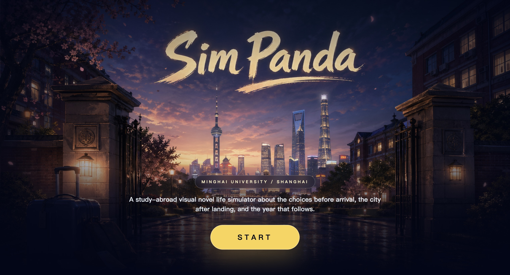
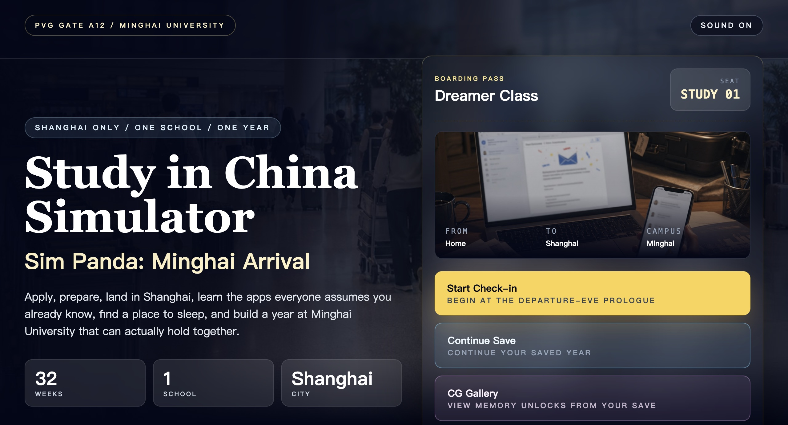
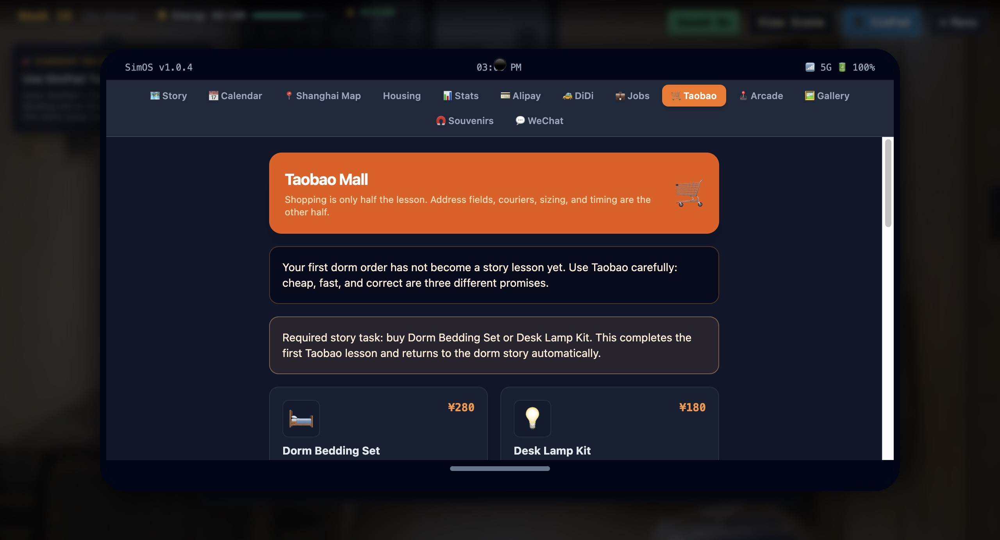
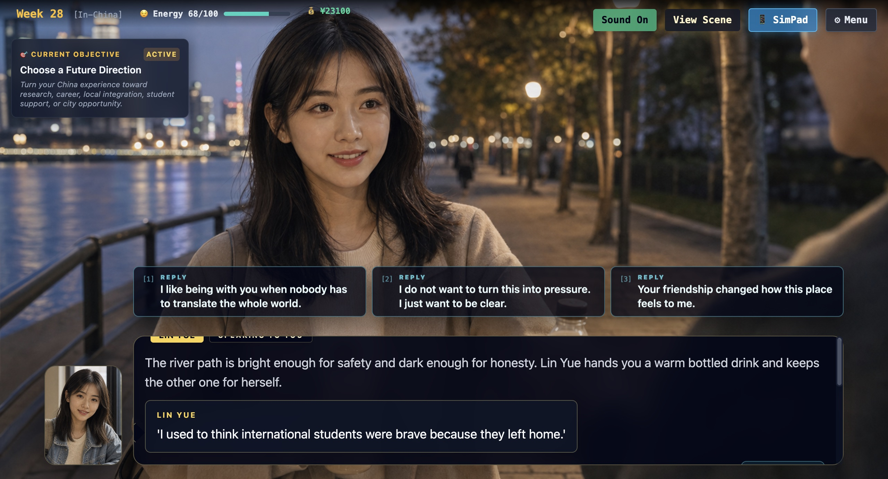

<div align="center">
  

  # Sim Panda - Study in China Simulator 🐼

  [](https://github.com/silverlion2/study_in_china_simulator/actions/workflows/build-release.yml)
  [](https://opensource.org/licenses/ISC)
  [](https://reactjs.org/)
  [](https://www.electronjs.org/)

  **A High-Fidelity, Choice-Driven RPG Life Simulator built with React and Electron.**

</div>

## 📥 Download and Play

You can download the compiled Windows `.exe` installer directly from the GitHub Cloud servers.

👉 **[Download the Latest Windows Release Here](https://github.com/silverlion2/study_in_china_simulator/releases/latest)**

---

## 🎮 Game Overview

**Sim Panda** is an immersive lifestyle simulator that puts you in the shoes of an international student navigating the exciting, challenging, and culturally rich process of studying abroad in China.

Using a precise 32-week turn-based schedule, players balance `Academics`, `Chinese`, `Culture`, `Digital Proficiency`, `Energy`, relationships, and `RMB Finances` across the full study-abroad arc: applying to Minghai University, preparing documents and digital tools, arriving in Shanghai, building routes, recovering from crises, and reaching one of several endings.

## 📸 Screenshots

Shareable screenshots from the current build:

| Cover | Start Menu |
| --- | --- |
|  |  |

| SimPad Tutorial | Character Dialogue |
| --- | --- |
|  |  |

| Ending Scene |
| --- |
|  |

## 🆕 Latest Update

The current development build expands Sim Panda into a fuller 2.0-style visual-novel life simulator:

- Added a complete title screen with `New Game`, `Load Game`, `CG Gallery`, and sound controls.
- Expanded the story into Application, Pre-Departure, and In-China phases with a concrete opening task chain, weekly action economy, route commitments, delayed consequences, and crisis recovery branches.
- Added visible route projects for Academic Portfolio, Internship Dossier, Neighborhood Map, Support Circle Guide, Shanghai Prototype, and Budget Ledger.
- Added relationship-driven character chains and reply choices for Professor Lin, Dr. Mei, Sophie, Xiao Chen, Neighbor Li, Uncle Wang, and Manager Zhang.
- Added Lin Yue, a Chinese female classmate with a forced Week 18 classroom introduction, a 1/6-to-6/6 relationship chain, optional light romance or close-friendship payoff, WeChat progression, Gallery unlocks, and ending afterword support.
- Standardized the character dialogue UI across the game: all supported character conversations now use a visual-novel style layout with a lower-left speaker portrait, aligned reply cards, readable dark dialogue panels, and consistent spacing across CG and non-CG scenes.
- Added Life Check resolution for high-pressure moments, with prep-card bonuses, route weighting, success/strain outcomes, and run-memory afterwords.
- Added SimPad systems for Calendar, Gallery / Memory Archive, DiDi, Taobao service orders, housing follow-up, WeChat meetups, jobs, souvenirs, character arcs, route projects, and player progress.
- Tightened onboarding clarity: named characters now receive explicit contact-card introductions before relationship choices, Week 12 housing must be confirmed through SimPad Housing, and airport DiDi arrival can require a SimPad ride action instead of resolving only through story text.
- Added required first-use SimPad tutorials for arrival DiDi, dorm Taobao ordering, Calendar deadline pinning, and WeChat check-ins so phone apps become playable story actions before opening as normal utilities.
- Clarified the weekly planner UI with action-point instructions, route-category descriptions, and a more concrete objective so players know what to do before midterm week arrives.
- Added visual QA screenshot capture for cover, title, required SimPad tutorials, weekly planner, midterm, Week 32 final submission, ending evaluation, and actual ending screens; tightened dense choice layouts, weekly planner spacing, SimPad spacing, ending readability, ending controls, ending HUD suppression, and typewriter fast-forward behavior based on those captures.
- Added GitHub-shareable screenshots under `docs/screenshots/` so the README can show the current cover, start menu, SimPad tutorial, character dialogue, and ending scene directly.
- Expanded the Memory Archive to 39 CG memories, including admission, documents, academic route scenes, local-life scenes, career milestones, Shanghai startup events, risk endings, housing pressure, phone-layer consequences, and new daily-life character CGs.
- Added a large visual asset library: campus backgrounds, Shanghai / China travel scenes, character portraits, v2 character art, route CGs, and compressed JPG runtime assets.
- Added audio infrastructure with `AudioManager`, audio manifests, fallback Web Audio BGM/SFX, MP3 background tracks, scene ambience routing, and choice-impact feedback sounds.
- Added automated full-route QA covering seven route profiles, six route project actions, three crisis recovery chains, the weekly action economy, and manual Week 17-24 arrival-to-midterm smoke testing.
- Added design, narrative, asset, audio, QA, character-bible, and handoff documentation for continuing development.
- Removed repeated Node ESM module-type warnings by scoping `data/` and `engine/` as ES modules while keeping the Electron entrypoint CommonJS-safe.
- Updated the build pipeline so the standalone `index.html` stays playable offline while supporting optional PandaOffer website export.

## ✨ Features

- **Dynamic Turn-Based Scheduling:** Manage 32 weeks of actions across distinct Epochs (Application, Pre-Departure, In-China).
- **RPG Stat System:** Track academics, language growth, culture, digital readiness, energy, money, guanxi, and character relationships.
- **Narrative Story Engine:** Multiple routes and endings shaped by weekly choices, route commitments, risk events, Life Checks, delayed consequences, and relationship trust.
- **Authentic Study-Abroad Flow:** Application essays, JW202 / X1 visa prep, WeChat and Alipay setup, housing, airport arrival, registration, first classes, internships, and local-life adaptation.
- **SimPad Tablet Interface:** In-game hub for milestones, stats, Calendar, CG memories, DiDi shortcuts, Taobao service orders, jobs, WeChat contacts, souvenirs, character arcs, route projects, and route progress.
- **Visual Novel Presentation:** 39 unlockable CG memories, character portraits, campus backgrounds, route scenes, and a title-screen gallery.
- **Audio Layer:** Scene-aware BGM/SFX manager with Web Audio fallback, optional MP3 asset manifest, ambience switching, stingers, and choice-impact feedback.

## 🛠️ Local Development

To run the simulator locally in its Electron container or browser:

```bash
# 1. Clone the repository
git clone https://github.com/silverlion2/study_in_china_simulator.git
cd study_in_china_simulator

# 2. Install dependencies (for Electron desktop wrapping)
npm install

# 3. Play via Desktop Client
npm start
```
*Note: If you only want to play in your browser, just double click `index.html`!*

### Validation

```bash
# Rebuild the standalone offline HTML
node build.js

# Validate story pointers, dialogue choices, and Life Check wiring
node validate_story.mjs

# Run automated full-route QA
npm run qa:routes

# Capture visual QA screenshots
npx electron tools/visual_qa_capture.cjs
```

## 🏗️ System Architecture

The project is structured to be highly pure, eschewing complicated bundle tooling (like Webpack) in favor of a raw React string-injected `build.js` pipeline. 

- `data/`: Contains the JSON node tree logic for event handling.
- `engine/`: The core `GameState.js` and `EventSystem.js` maintaining state without Redux.
- `components/`: Modular React components tracking specific UI functions (like the `TabletInterface`).
- `tools/`: QA and production helper scripts, including full-route route feasibility checks.
- `images/` and `assets/`: Runtime visual and audio assets used by the standalone build.
- `docs/`: Visual asset plans, prompt records, contact sheets, and production notes.

## 📜 License
ISC License
